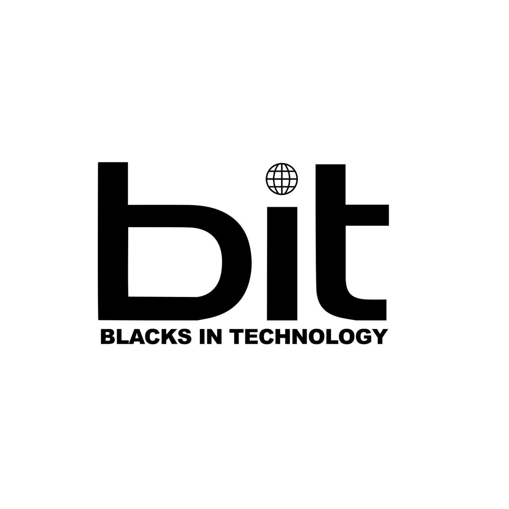

# BIT Scholarship Projects Notes

This repository collects general notes, descriptions, and tips for all the projects of the **Cloud**, **Product**, and **Data Science** track.

> _Everyone is welcome to contribute_

<p align="center">

</p>

## How to send your notes?

There are two ways you can collaborate to this repo:

### 1. You can ask for Collaborator permissions and modify the files directly

Communicate via Slack or open an Issue here in GitHub. It would be a pleasure to add you as a collaborator.

### 2. You can fork this repo and submit a pull request

You will only need to have [git](https://git-scm.com/book/en/v2/Getting-Started-Installing-Git) installed on your machine.

[Fork this repository](https://github.com/carneiroDotDev/BIT_Scholarship_Project_Notes/fork)

```bash
#1. Fork the repository to your GitHub account
...

#2. Clone it to your local machine:
git clone https://github.com/{YOUR GITHUB USERNAME}/BIT_Scholarship_Project_Notes.git

#3. Enter the directory:
cd BIT_Scholarship_Project_Notes

#4. Make your desired changes using any editor
code .

#5. Add and Commit your changes
git commit -m 'I added this and this. That note was modified because of something.'

#6. Push the repository to your forked repo on GitHub
git push

#7. Open a merge request on
https://github.com/carneiroDotDev/BIT_Scholarship_Project_Notes

```

## Repository completion

### Cloud Track

- :white_check_mark: Project 1 - Deploy website on AWS
- :black_square_button: Project 2 -
- :black_square_button: Project 3 -
- :black_square_button: Project 4 -
- :black_square_button: project 5 -
